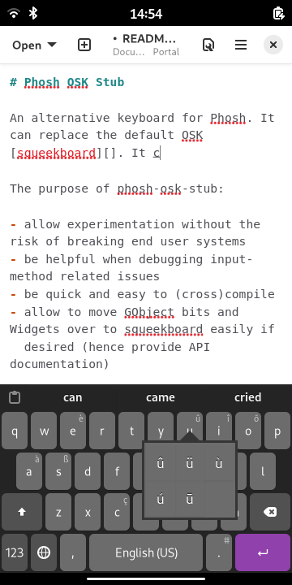
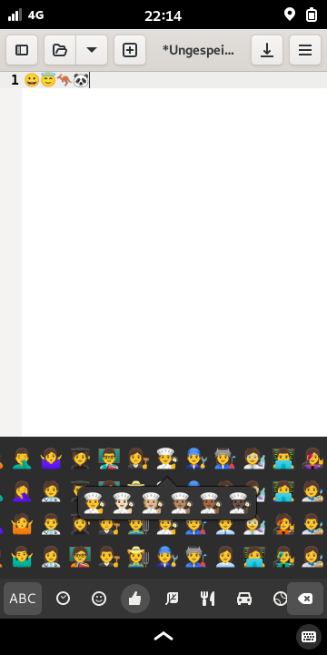
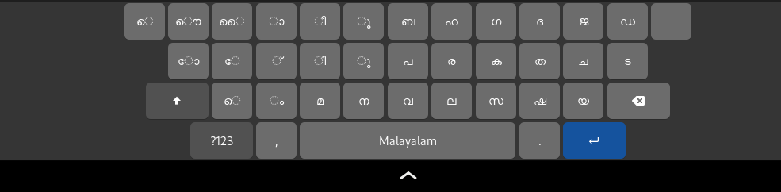

# Phosh OSK Stub

An experimental keyboard for quick prototyping and to debug input related
issues in phosh. For a production ready on-screen keyboard see [squeekboard][].

The purpose of phosh-osk-stub:
- allow experimentation without the risk of breaking end user systems
- be helpful when debugging input-method related issues
- be quick and easy to (cross)compile
- allow to move GObject bits and Widgets over to squeekboard easily if
  desired (hence provide API documentation)

Features:
- easy to swap out with squeekboard (implements phosh's [sm.puri.OSK0]() DBus
  interface) for low risk experimentation
- easy to temporarily replace running instance (`--replace` option)
- no language boundaries within the codebase to lower the entrance barrier
- use current GTK and GObject patterns (actions, bindings, …)
- use GNOME libs and technologies wherever possible (GSettings, json-glib, …)
- [character popover](https://gitlab.gnome.org/guidog/phosh-osk-stub/-/raw/main/screenshots/pos-popover.png)
- [emoji layout](https://gitlab.gnome.org/guidog/phosh-osk-stub/-/raw/main/screenshots/pos-emoji.png)
- cursor navigation via space-bar long-press
- word correction via hunspell
- use any program as completer via a `pipe` completer ([Example](https://social.librem.one/@agx/110260534404795348))
- experimental [word completion](https://social.librem.one/@agx/109428599061094716)
  based on the presage library
- experimental input of Indic languages using [varnam](https://github.com/varnamproject)
- allow to prevent keyboard unfold for certain apps (via app-id)
- allow to prevent keyboard unfold when a hardware keyboard is present

## License

phosh-osk-stub is licensed under the GPLv3+.

## Getting the source

```sh
git clone https://gitlab.gnome.org/guidog/phosh-osk-stub
cd phosh-osk-stub
```

The [main][] branch has the current development version.

## Dependencies
On a Debian based system run

```sh
sudo apt-get -y install build-essential
sudo apt-get -y build-dep .
```

For an explicit list of dependencies check the `Build-Depends` entry in the
[debian/control][] file.

## Building

We use the meson (and thereby Ninja) build system for phosh-osk-stub.
The quickest way to get going is to do the following:

```sh
meson setup -Dgtk_doc=false _build
meson build -C _build
meson test -C _build
```

We're disabling the doc build above as it reduces build time a lot.

## Running
### Running from the source tree
When running from the source tree first start *[phosh][]*.
Then start *phosh-osk-stub* using:

```sh
_build/run --replace
```

Note that there's no need to install any files outside the source tree. The
`--replace` option *temporarily* replaces a running `phosh-osk-stub` so there's
no need to stop a running instance.

The result should look something like this:





## Word completion
``phosh-osk-stub`` has support for word completion. There are different
completers built in and it's easy to add more. See the [manpage][] on
available completers and how to configure them.

## Documentation

### Development Documentation

The API documentation is available at https://guidog.pages.gitlab.gnome.org/phosh-osk-stub .

### End User Documentation

For end user documentation see the [manpage][] (or in the installed system via `man phosh-osk-stub`).

[main]: https://gitlab.gnome.org/guidog/phosh-osk-stub/-/tree/main
[.gitlab-ci.yml]: https://gitlab.gnome.org/guidog/phosh-osk-stub/-/blob/main/.gitlab-ci.yml
[debian/control]:https://gitlab.gnome.org/guidog/phosh-osk-stub/-/blob/main/debian/control
[phosh]: https://gitlab.gnome.org/World/Phosh/phosh
[squeekboard]: https://gitlab.gnome.org/World/Phosh/squeekboard
[sm.puri.OSK0]: https://gitlab.gnome.org/World/Phosh/phosh/-/blob/main/src/dbus/sm.puri.OSK0.xml
[phosh-osk-data]: https://gitlab.gnome.org/guidog/phosh-osk-data/
[manpage]: ./doc/phosh-osk-stub.rst
