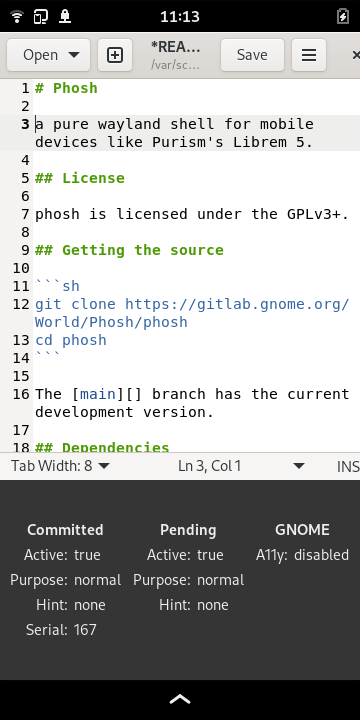
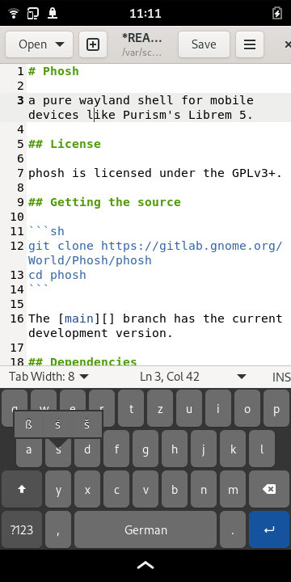

# Phosh OSK Stub

An experimental keyboard for quick prototyping and to debug input related
issues in phosh. For a production ready on-screen keyboard see [squeekboard][].

The purpose of phosh-osk-stub:
- allow experimentation without the risk of breaking end user systems
- be helpful when debugging input-method related issues
- be quick and easy to (cross)compile
- allow to move GObject bits over to squeekboard easily if desired
  (hence provide API documentation)

Features:
- easy to swap out with squeekboard (implements phosh's [sm.puri.OSK0]() DBus
  interface) for low risk experimentation
- easy to temporarily replace running instance (`--replace` option)
- no language boundaries within the codebase to lower the entrance barrier
- use current GTK/GObject patterns (actions, bindings, …)
- use GNOME libs/technologies wherever possible (GSettings, json-glib, …)
- [character popover](https://gitlab.gnome.org/guidog/phosh-osk-stub/-/raw/main/screenshots/pos-de.png)
- cursor navigation via space-bar long-press
- experimental [word completion](https://social.librem.one/@agx/109428599061094716)
  based on the presage library
- debug surface with additional information
- swipeable layout switching

## License

phosh-osk-stub is licensed under the GPLv3+.

## Getting the source

```sh
git clone https://gitlab.gnome.org/guidog/phosh-osk-stub
cd phosh-osk-stub
```

The [main][] branch has the current development version.

## Dependencies
On a Debian based system run

```sh
sudo apt-get -y install build-essential
sudo apt-get -y build-dep .
```

For an explicit list of dependencies check the `Build-Depends` entry in the
[debian/control][] file.

## Building

We use the meson (and thereby Ninja) build system for phosh-osk-stub.
The quickest way to get going is to do the following:

```sh
meson . _build
meson build -C _build
meson test -C _build
```

## Running
### Running from the source tree
When running from the source tree first start *[phosh][]*.
Then start *phosh-osk-stub* using:

```sh
_build/run --replace
```

Note that there's no need to install any files outside the source tree. The
`--replace` option *temporarily* replaces a running `phosh-osk-stub` so there's
no need to stop a running instance.

The result should look something like this:





## Word Completion
phosh-osk-stub has experimental support for word completion based on the
presage libarary. For this to work you need:

- A model file in /usr/share/phosh/osk/presage/. Likely your distribution
  already ships one with the presarge libary. You can simply simplink there.
  See `debian/phosh-osk-stub.links`. Models for more languages can be found
  in [phosh-osk-data][].
- An appplication that used recent GTK3 (>= 3.24.35). GTK4 apps work
  somewhat as well but there's currenly an issues with cursor
  movement.
- Completion enabled in settings:

        gsettings set sm.puri.phosh.osk completion-mode "['manual','hint']"

Completion can then be enabled/disabled via the language popover. To permanently
disable it use:

        gsettings reset sm.puri.phosh.osk completion-mode

## Development Documentation

API documentation is at https://guidog.pages.gitlab.gnome.org/phosh-osk-stub

[main]: https://gitlab.gnome.org/guidog/phosh-osk-stub/-/tree/main
[.gitlab-ci.yml]: https://gitlab.gnome.org/guidog/phosh-osk-stub/-/blob/main/.gitlab-ci.yml
[debian/control]:https://gitlab.gnome.org/guidog/phosh-osk-stub/-/blob/main/debian/control
[phosh]: https://gitlab.gnome.org/World/Phosh/phosh
[squeekboard]: https://gitlab.gnome.org/World/Phosh/squeekboard
[sm.puri.OSK0]: https://gitlab.gnome.org/World/Phosh/phosh/-/blob/main/src/dbus/sm.puri.OSK0.xml
[phosh-osk-data]: https://gitlab.gnome.org/guidog/phosh-osk-data/
